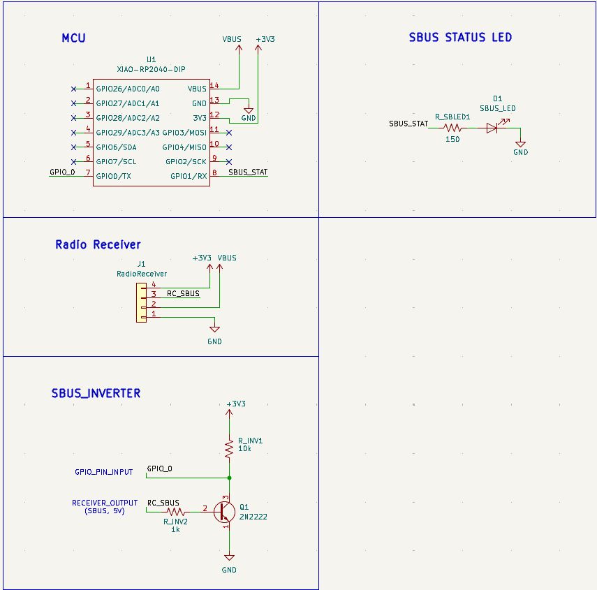
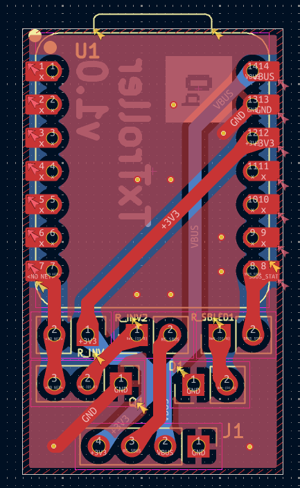
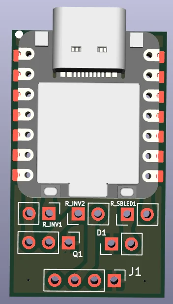
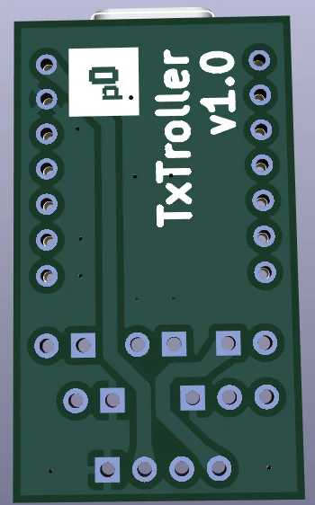
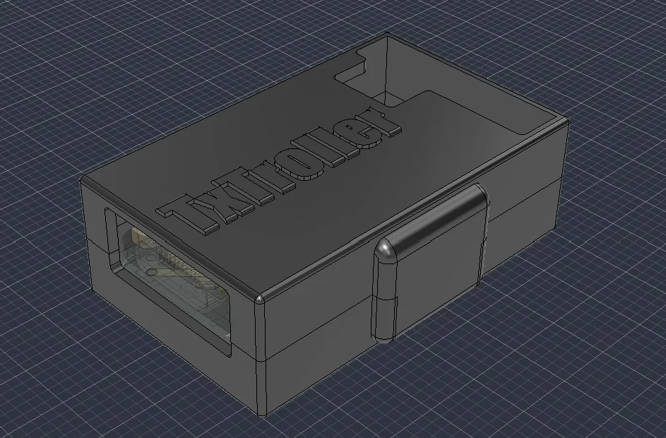
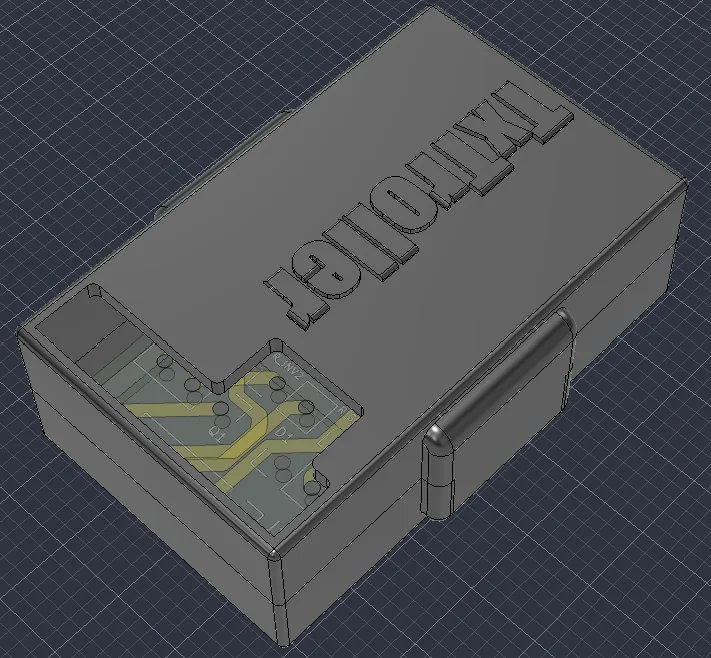
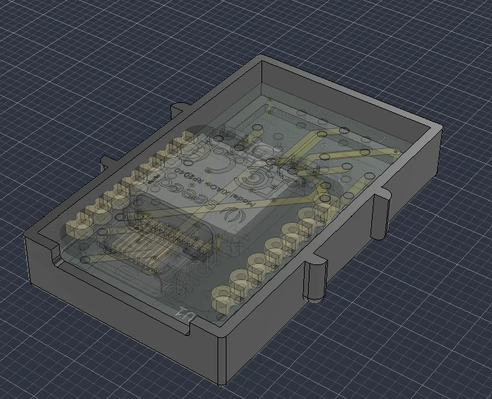
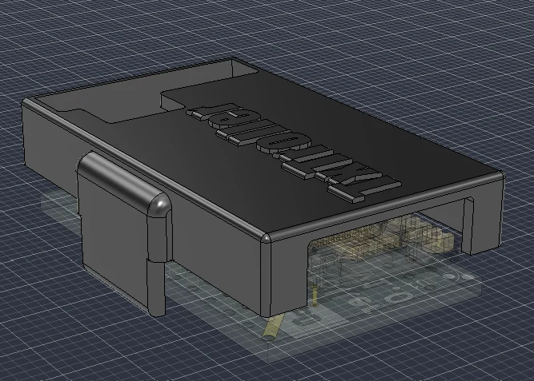

# **TxTroller**
*A Radio Receiver-to-USB HID Gamepad Adapter.*

# The Plan
This is a simple adapter that will allow older-style Radio transmitter / receiver combos to be used as video-game controllers using the USB HID Gamepad device class.

## Hardware
For the initial stages, this is being developed for the [`Radiolink R8EF`](https://www.radiolink.com/r8ef) receiver, which is an 8-channel receiver operating on the 2.4GHz frequency band.

As for the transmitter that will be the actual gamepad, It will be the [`Radiolink T8FB`](https://www.radiolink.com/t8fb) transmitter, which is a 2.4GHz 8 Channels RC Remote Transmitter.

The microcontroller that will be responsible for translating the SBUS signals from the receiver to the USB device class will be an [`XIAO RP2040`](https://wiki.seeedstudio.com/XIAO-RP2040/) due to it's small footprint and easy-to-use C/C++ SDK.

## PCB

The PCB has been designed using KiCAD 9.0. It is a 2 layer PCB with both top and bottom having thick signal traces and a ground fill.

PCB Schematics:

PCB layout:

PCB Preview:

## 3D Case

The case has been designed in Fusion 360, with the `.f3z` available in the [/CAD](./CAD/) directory, along with the exported `.step` files of the top and bottom parts of the case in [/CAD/exports](./CAD/exports).

The case looks like this:

The case has side extrusions for friction-fitting the top and bottom part of the case together.

## Firmware
*Originally modified from [raspberrypi/pico-examples/tree/master/usb/device/dev_hid_composite
](https://github.com/raspberrypi/pico-examples/tree/master/usb/device/dev_hid_composite).*

Checkout the [Firmware directory](./Firmware/) to view more information on button mappings, firmware compiling / flashing and testing the data received from the receiver.

## Ordering & BOM

The PCB contains no SMD components or any other component that cannot be soldered using a normal soldering iron, hence no PCBA is required.

The PCB gerber .zip file is available in [PCB/exports/](./PCB/exports/).

### BOM Table
---

| S.No | Item Name        | Description                    | Product URL                                                                              | Qty | Unit Price ($) | Effective Price ($) |
| ---: | ---------------- | ------------------------------ | ---------------------------------------------------------------------------------------- | --: | -------------: | ------------------: |
|    1 | XIAO RP2040      | RP2040 Microcontroller         | [XIAO RP2040](https://robocraze.com/products/seeed-studio-xiao-rp2040-development-board) |   1 |           6.14 |                6.14 |
|    2 | PCB              | PCB manufacturing cost (5 qty) | [Lion Circuits](https://www.lioncircuits.com/quote)                                      |   1 |           9.84 |                9.84 |
|    3 | 1k Ohm Resistor  | 1k Ohm Resistor - Pack of 10   | [1k Resistor Pack](https://robocraze.com/products/1k-resistor-pack-of-10)                |   1 |           0.13 |                0.13 |
|    4 | 10k Ohm Resistor | 10k Ohm Resistor - Pack of 10  | [10k Resistor Pack](https://robocraze.com/products/10k-resistor-pack-of-10)              |   1 |           0.14 |                0.14 |
|    5 | 100 Ohm Resistor | 100 Ohm Resistor - Pack of 10  | [100 Ohm Resistor Pack](https://robocraze.com/products/100-ohm-resistor-pack-of-10)      |   1 |           0.16 |                0.16 |
|      |                  |                                |                                                                                          |     |      **Total** |           **16.41$** |

---

> *Note that the PCB states 150ohm resistor but we have only added 100ohm, this is because we can arrange 3 100 ohm resistors in such a way that the effective resistance becomes 150ohms (2parallel+1series).*

## 😼💖